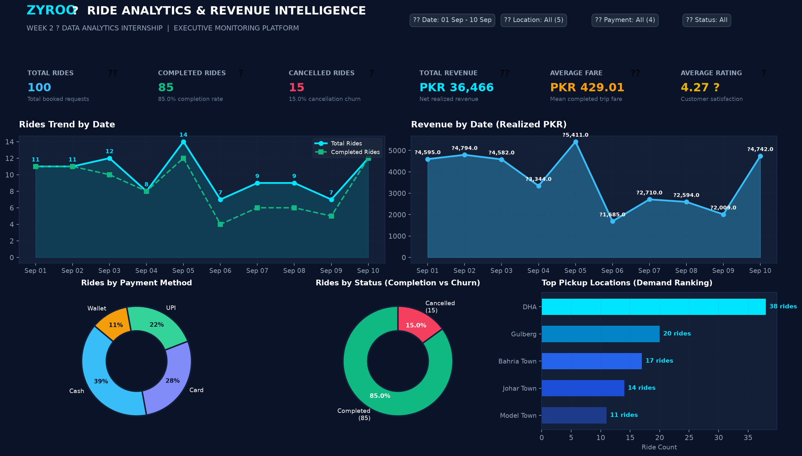

# 🚀 Zyroo Data Analyst Internship Portfolio

Welcome to my official portfolio repository for the **Zyroo Data Analyst Internship**. This repository serves as a centralized hub documenting weekly technical deliverables, automated data pipelines, exploratory data analyses, SQL pipelines, and executive Business Intelligence dashboards.

---

## 📋 Table of Contents
* [Week 2 — Ride Analytics & Revenue Intelligence Platform (Power BI)](#-week-2--ride-analytics--revenue-intelligence-platform)
* [Week 1 — Onboarding & Environment Setup](#-week-1--onboarding--environment-setup)
* [Repository Structure](#-repository-structure)
* [Technical Environment](#-technical-environment)

---

## 🚕 Week 2 — Ride Analytics & Revenue Intelligence Platform

**Project Title**: Ride Analytics & Revenue Intelligence Platform  
**Program**: ZYROO Data Analytics Internship • Week 2  
**Level**: Industry Portfolio Grade (Executive Dashboard)  
**Deliverables**: Cleaned Dataset, Data Pipeline Script, DAX Measure Catalog, Interactive Dashboard, and Power BI Report Specification



[](https://colab.research.google.com/github/evilswordboy-bot/zyro-data-analyst-internship/blob/main/week-02/ride_analytics_google_colab.ipynb)
[](week-02/rides_data_google_sheets.xlsx)
[](week-02/google_looker_studio_guide.md)

### 🎯 Objective
Design and implement an executive-level, visually stunning Power BI dashboard monitoring fleet performance, passenger demand patterns, payment preferences, operational churn (cancellations), and realized financial yield.

### 🧹 Data Cleaning Pipeline (`week-02/clean_and_analyze.py`)
The raw dataset was rigorously audited and cleaned following data engineering best practices:
1. **Deduplication**: Audited unique identifiers and removed duplicate `Ride ID` entries.
2. **Invalid Rows**: Filtered out completely empty records.
3. **Type Consistency**: Coerced and validated ISO `Date` timestamps and numerical `Fare` types.
4. **Range Validation**: Removed corrupt negative fare records (`Fare >= 0`).
5. **Domain Null Handling**: Validated missing customer ratings; in ride-hailing domain logic, cancelled trips do not capture passenger reviews. Structural nulls were verified and preserved accurately.

### 📊 Top Executive KPI Metrics
Calculated directly from the 100-ride production dataset:
* **Total Bookings**: `100 rides` (Gross platform demand)
* **Completed Rides**: `85 rides` (85.0% fulfillment rate)
* **Cancelled Rides**: `15 rides` (15.0% cancellation churn)
* **Total Realized Revenue**: `PKR 36,466.00` (Gross Booked: `PKR 42,962.00`)
* **Average Ticket Size**: `PKR 429.01` (Per completed trip)
* **Customer Satisfaction**: `4.27 / 5.00 ★` (Strong driver rating)

### 📐 Power BI DAX Measures Dictionary (`week-02/dax_measures.dax`)
```dax
Total Rides = COUNT('Rides'[Ride ID])

Completed Rides = CALCULATE(COUNTROWS('Rides'), 'Rides'[Ride Status] = "Completed")

Cancelled Rides = CALCULATE(COUNTROWS('Rides'), 'Rides'[Ride Status] = "Cancelled")

Total Revenue = CALCULATE(SUM('Rides'[Fare]), 'Rides'[Ride Status] = "Completed")

Average Fare = CALCULATE(AVERAGE('Rides'[Fare]), 'Rides'[Ride Status] = "Completed")

Average Rating = CALCULATE(AVERAGE('Rides'[Rating]), NOT(ISBLANK('Rides'[Rating])), 'Rides'[Ride Status] = "Completed")

Cancellation Rate = DIVIDE([Cancelled Rides], [Total Rides], 0)
```

### 💡 Automatically Calculated Business Insights
1. **Demand Epicenter**: **DHA** is the highest-volume pickup hub, commanding **38 rides (38.0% market share)**, outperforming Gulberg (20 rides) and Bahria Town (17 rides).
2. **Payment Channel Dominance**: **Cash** remains the primary transaction medium (**39.0%**), followed by Card (28.0%), UPI (22.0%), and Mobile Wallets (11.0%).
3. **Operational Churn & Revenue Leakage**: The fleet operates at a **15.0% cancellation rate**, resulting in **PKR 6,496.00** in unrealized gross booking value.
4. **Peak Performance Window**: Peak fleet utilization and daily realized revenue occurred on **Sep 05, 2026** (**14 rides**, yielding **PKR 5,411.00**).
5. **Service Quality**: Completed journeys average a healthy **4.27 ★ rating**, reflecting solid customer retention and service satisfaction.

---

## 🛠️ Week 1 — Onboarding & Environment Setup

The objective of **Task 01** was establishing an isolated analytics environment, verifying Python, SQL, Excel, and Power BI environments, benchmark testing on structured datasets, and publishing to GitHub.

* **Jupyter Analysis**: Ingested `sales_data.csv`, validated nulls, evaluated statistical metrics, and rendered Seaborn distribution plots (`week-01/environment_test.ipynb`).
* **Relational SQL Pipeline**: Implemented SQLite schema, populated transactions, and authored aggregation queries with `GROUP BY` and `HAVING` (`week-01/sql_test.sql`).
* **Spreadsheet & BI**: Verified dynamic `=SUM()` formulas in Excel (`sales_test.xlsx`) and launched Power BI Desktop.
* **Evidence Management**: Cataloged 7 verification screenshots inside `week-01/evidence/`.

---

## 📁 Repository Structure

```text
zyro-data-analyst-internship/
│
├── week-02/                                # Week 2: Power BI Ride Analytics Platform
│   ├── rides_data_cleaned.csv             # Cleaned production dataset (100 rows)
│   ├── rides_raw_data.csv                 # Raw dataset with anomalies for cleaning tests
│   ├── clean_and_analyze.py               # Automated cleaning & metric calculation engine
│   ├── dax_measures.dax                   # Power BI DAX measures reference catalog
│   ├── dashboard_interactive.html         # Interactive web-based dashboard emulator
│   └── assets/
│       └── dashboard_preview.png          # High-resolution executive dashboard render
│
├── week-01/                                # Week 1: Environment & Tooling Verification
│   ├── environment_test.ipynb             # Executed Jupyter notebook with CSV analysis
│   ├── sql_test.sql                       # SQLite DDL, DML and analytical queries
│   ├── sales_data.csv                     # Structured retail transactions dataset
│   ├── sales_test.xlsx                    # Formatted Microsoft Excel workbook
│   └── evidence/                          # System verification screenshots
│       ├── python_version.png
│       ├── git_version.png
│       ├── powerbi_setup.png
│       ├── excel_setup.png
│       ├── sql_test.png
│       ├── jupyter_analysis.png
│       └── zyroo_community.png
│
├── README.md                              # Portfolio master documentation
├── requirements.txt                       # Pinned Python package dependencies
└── .gitignore                             # Git exclusion rules
```

---

## 💻 Technical Environment
* **Platform**: Windows 11 / PowerShell 5.1 / Python 3.13.15
* **Analytics Stack**: Pandas, NumPy, Matplotlib, Seaborn, OpenPyXL, SQLite3
* **Business Intelligence**: Power BI Desktop, Microsoft Excel 2016/365
* **Version Control**: Git 2.55 & GitHub CLI
